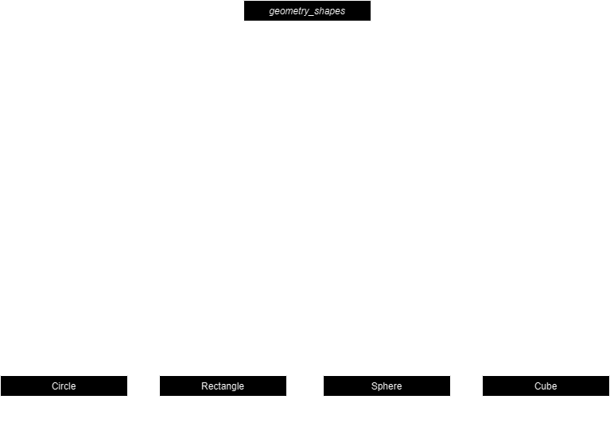
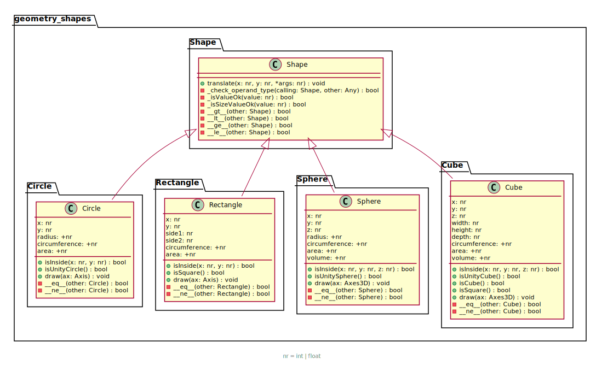
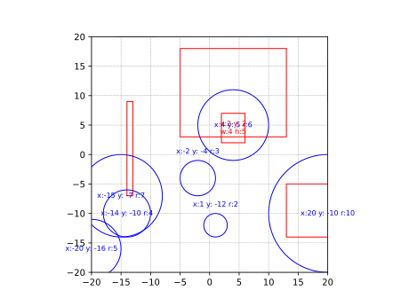

# Lab 3

The task, which in essence was to create geometrical object classes in a neatly structured way, can be found in the PDF file in the assets folder.

## Initial UML chart
Here's an initial UML chart of my general idea of the structure before beginning to code:



## How it turned out
The folder name is still geometry_shapes, but the superclass is simply called Shape. The Shape class has no attributes or properties, but it does contain the translate method, as it's common for all classes, and the comparison operator overloads (that compare the area of the objects).

I found that the value of adding a 2D or 3D shape layer in between the super- and sub classes would be negative, as there is no great need to emphasize the character of the objects as it's already known. Also, the 2D classes  differ as much from each other as the 2D and 3D classes do. 


## Plotting
To do plotting using the .draw() method, you first need to import matplotlib:
```python
import matplotlib.pyplot as plt
```
Depending on if you want to plot 2D or 3D objects or both (not in the same plot), you need to do the following:
### In 2D
First create the figure and axis:
```python
fig, ax = plt.subplots()
```

Then create the objects you want to plot, and tell them to draw on the axis you created, e.g:

```python
my_circle = Circle()
my_circle.draw(ax, label=True)
```

Where ``label=True`` indicates that position and size should be printed in text form also (only implemented for 2D objects). You can then set the parameters for the plotting and finally show the objects:

```python
ax.set_xlim(-20, 20)
ax.set_ylim(-20, 20)
ax.grid(True, linestyle='--', linewidth=0.5, alpha=0.7, color='gray')

plt.gca().set_aspect('equal', adjustable='box')
plt.show()
```
Example 2d plot:




### In 3D
First create an axis:
```python
fig3D = plt.figure()
ax3D = fig3D.add_subplot(111, projection='3d')
```

When you then draw for instance a 3D Cube, you pass on the ax3D object as an argument to .draw():
```python
my_cube = Cube(x=2, y=1, z=-2, width=2, height=3, depth=4)
my_cube.draw(ax3D)
``` 
Then you can set the spatial limits and the aspect ratio, before finally showing the 3D object(s). It is possible to rotate the view.
```python
ax3D.set_xlim(-20, +20)
ax3D.set_ylim(-20, +20)
ax3D.set_zlim(-20, +20)

ax3D.set_box_aspect([1,1,1])
plt.show()
``` 
Example 3d plot:


## Testing
Test files have been written for pytest. They are stored in the lab3 root folder. To run the tests, go to that folder and run:
```bash
pytest .
```
Which yields results similar to these:
```
Test results:
============================ 55 passed in 0.82s ============================= 
PS ..\Labs\lab3> pytest .
============================ test session starts ============================
platform win32 -- Python 3.11.5, pytest-7.4.2, pluggy-1.3.0
rootdir: ..\Labs\lab3
collected 55 items

test_subclasses.py .................................................  [ 89%]
test_superclass.py ......                                             [100%]

============================ 55 passed in 0.82s ============================
```

### Still to do
* Verify comparisons work again
* Add tests for checking comparisons between classes